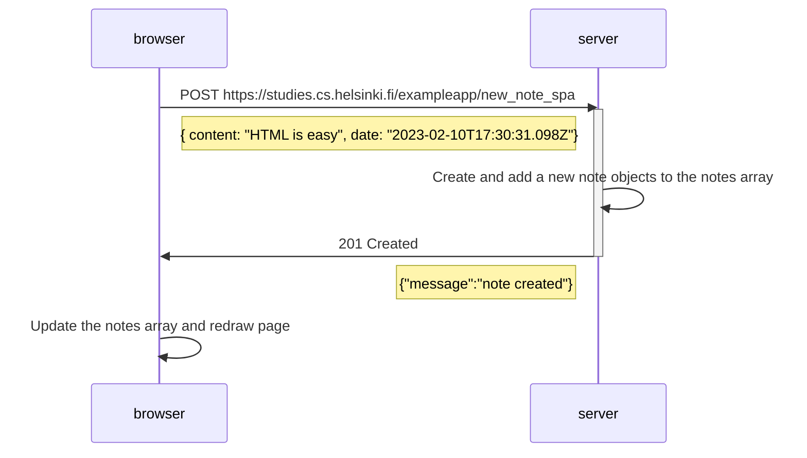

```mermaid
sequenceDiagram
participant browser
participant server
    browser->>server: POST https://studies.cs.helsinki.fi/exampleapp/new_note_spa
    activate server

    Note right of browser: { content: "HTML is easy", date: "2023-02-10T17:30:31.098Z"}

    server->>server: Create and add a new note objects to the notes array

    server->>browser: 201 Created
    deactivate server

    Note left of server: {"message":"note created"}

    browser->>browser: Update the notes array and redraw page

```
